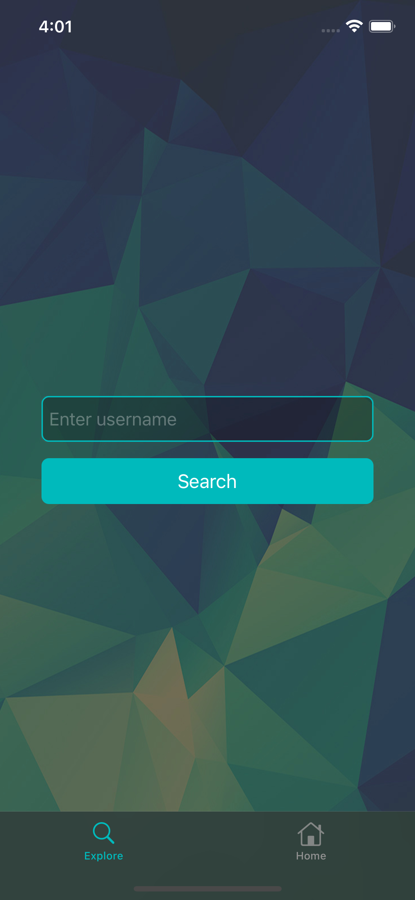

## Description
The app allows you to view information about your **intra 42** profile and search for information about other students.
The student profile shows the student's current location in school, level, tables with completed projects, skill charts, etc.
In order to start searching for students, you need to sign in to your profile (if you are not a student of the school, you will not be able to sign in at all).
The *oauth2* protocol and *ASWebAuthenticationSession* web service are used for authorization.
After two hours, the authorization token expires and a new one is created to continue to use the application.

## Technologies used
- UIKit
- URLSession
- Auto Layout
- ASWebAuthentication
- Cocoapods (Charts)

## App Overview
#### Screens

	
	
	
	

	
	
	
	

	

